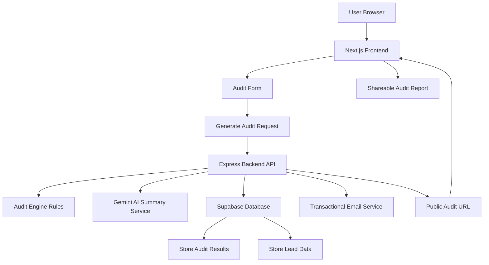

# ARCHITECTURE.md

# SpendLens Architecture

SpendLens is a full-stack AI spend auditing platform designed to help startups analyze and optimize AI tooling costs across products like ChatGPT, Claude, Cursor, Gemini, GitHub Copilot, and AI APIs.

The application follows a modern client-server architecture with a Next.js frontend, Express backend, Supabase database, and Gemini-powered AI summaries.

---

# System Architecture Diagram



---

# Data Flow

## 1. User Input

A visitor lands on the SpendLens website and enters:
- AI tools used
- Current plans
- Monthly spend
- Team seats
- Team size
- Primary use case

The frontend stores form state using localStorage so users do not lose progress on refresh.

---

## 2. Audit Generation

The frontend sends audit data to the Express backend API.

Example flow:

```txt
Frontend Form
→ POST /api/audit
→ Backend Audit Engine
→ Savings Calculation
→ AI Summary Generation
→ Database Storage
→ Audit Response
```

---

## 3. Audit Engine Processing

The backend audit engine evaluates:
- Oversized enterprise plans
- Small teams on expensive plans
- API overspending
- Coding workflow optimization
- Plan downgrade opportunities
- Cost-saving alternatives

The engine uses deterministic financial rules rather than AI-generated calculations to ensure recommendations remain explainable and finance-defensible.

---

## 4. AI Summary Generation

After calculations complete:
- Gemini API generates a personalized strategic summary
- If Gemini fails, fallback handling prevents application crashes
- The generated summary is stored with the audit

This is the only AI-driven part of the system.

---

## 5. Audit Storage

Audit reports are stored inside Supabase with:
- Audit ID
- Savings data
- Recommendations
- AI summary
- Public sharing support

Sensitive lead information is separated from public reports.

---

## 6. Lead Capture

After users receive value from the audit:
- Users can optionally save their report
- Email and company details are stored in Supabase
- Transactional confirmation emails are sent

Honeypot protection is used to reduce spam submissions.

---

## 7. Public Audit Sharing

Each audit receives a unique public URL:

```txt
/audit/[id]
```

Public reports expose:
- Tool recommendations
- Savings numbers
- AI summary

Public reports do NOT expose:
- Emails
- Company details
- Private lead information

---

# Stack Decisions

## Frontend — Next.js + TypeScript

Why:
- App Router support
- Better routing and metadata handling
- Improved SEO
- Faster deployment with Vercel
- Strong TypeScript ecosystem

---

## Backend — Express.js

Why:
- Lightweight API architecture
- Fast iteration speed
- Easy deployment on Render
- Simpler integration with Supabase and Gemini

---

## Database — Supabase

Why:
- Rapid backend setup
- Managed PostgreSQL
- Simple SDK integration
- Reliable cloud storage
- Reduced infrastructure complexity

---

## Styling — TailwindCSS

Why:
- Rapid UI iteration
- Utility-first styling
- Easier responsive layouts
- Cleaner component styling workflow

---

## AI Provider — Gemini API

Why:
- Accessible free-tier usage
- Fast responses
- Good summary quality
- Easy integration during MVP development

---

# Abuse Protection

SpendLens uses a honeypot field strategy for spam prevention.

Reasoning:
- Lower user friction than CAPTCHA
- Better conversion rate
- Simpler MVP implementation
- Effective enough for early-stage traffic

---

# Scalability Considerations

Current architecture is optimized for MVP velocity rather than large-scale throughput.

If SpendLens needed to handle 10,000+ audits/day:

## Changes I Would Make

### 1. Queue-Based AI Summary Processing
Move AI summary generation into asynchronous background jobs using:
- BullMQ
- Redis queues

This would reduce API latency and improve reliability.

---

### 2. Caching Layer
Introduce Redis caching for:
- Pricing data
- Common audit calculations
- Public audit pages

---

### 3. Database Optimization
- Add indexing for audit lookup
- Separate analytics tables
- Partition historical audit data

---

### 4. Rate Limiting
Introduce:
- IP-based request throttling
- API rate limiting middleware
- Bot detection systems

---

### 5. Monitoring & Observability
Add:
- Sentry
- PostHog
- Structured logging
- Performance monitoring

---

# Deployment Architecture

## Frontend
- Hosted on Vercel

## Backend
- Hosted on Render

## Database
- Hosted on Supabase

## CI/CD
- GitHub Actions automatically runs audit engine tests on every push to main branch

---

# Performance Considerations

The application prioritizes:
- Minimal frontend JavaScript
- Lightweight API responses
- Fast audit generation
- Mobile responsiveness
- Simple database queries

The current MVP architecture focuses on speed of iteration while maintaining reasonable scalability and maintainability.

---